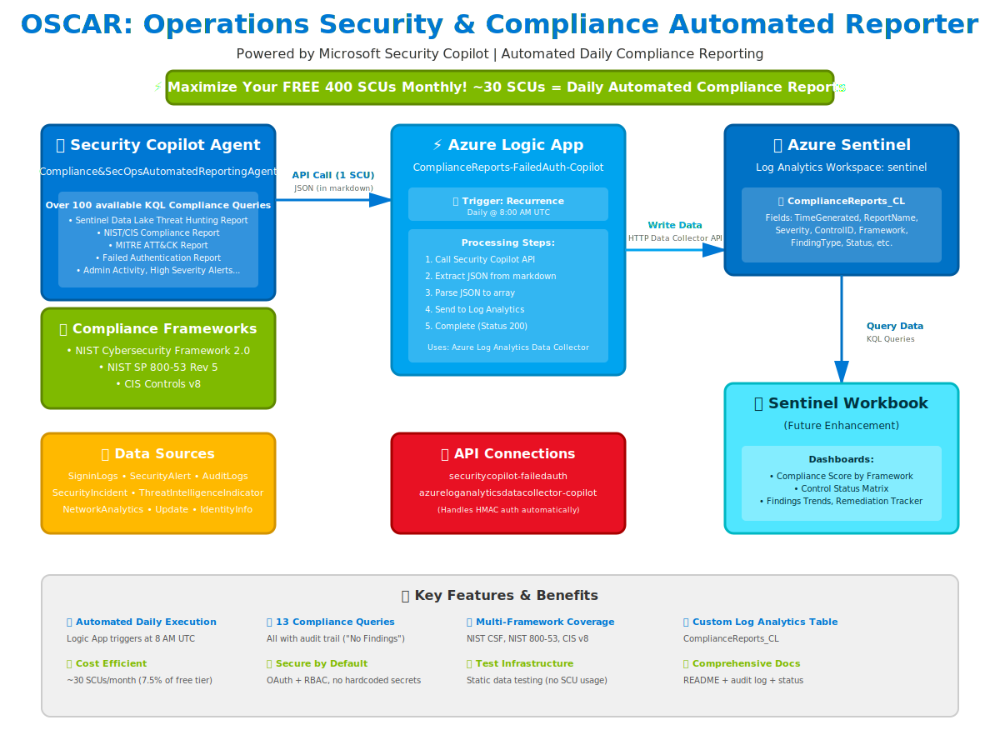

# 🕶️ OSCAR: Operations Security & Compliance Automated Reporter

<p align="center">
  
</p>

<p align="center">
  <strong>Maximize Your FREE 400 SCUs Monthly!</strong><br>
  Automated compliance reporting powered by Microsoft Security Copilot
</p>

<p align="center">
  
  
  
  
</p>

---

## 🎯 What is OSCAR?

**OSCAR** is an intelligent, automated compliance and threat hunting platform that transforms Microsoft Security Copilot into your 24/7 security operations assistant. Built for security teams who want comprehensive compliance reporting without the manual effort.

### Key Benefits

✅ **Automated Daily Execution** - Set it and forget it
✅ **100+ Compliance Queries** - NIST, CIS, MITRE ATT&CK coverage
✅ **Audit Trail Guaranteed** - Every query returns results (even "No Findings")
✅ **Cost Efficient** - Uses only 7.5% of your free monthly SCUs
✅ **Production Ready** - Deploy in minutes with ARM templates

---

## 🏗️ Architecture

```
┌─────────────────────────────────────────────────────────────┐
│  Security Copilot Agent (OSCAR)                             │
│  • 100+ KQL Compliance Queries                              │
│  • NIST CSF 2.0, NIST 800-53, CIS Controls v8               │
└────────────────┬────────────────────────────────────────────┘
                 │ API Call (1 SCU per execution)
                 ▼
┌─────────────────────────────────────────────────────────────┐
│  Azure Logic App                                            │
│  • Scheduled: Daily @ 8:00 AM UTC                           │
│  • Process: Strip markdown → Parse JSON → Send data         │
└────────────────┬────────────────────────────────────────────┘
                 │ HTTP Data Collector API
                 ▼
┌─────────────────────────────────────────────────────────────┐
│  Azure Sentinel / Log Analytics                             │
│  • Table: ComplianceReports_CL                              │
│  • 90-day retention                                         │
└────────────────┬────────────────────────────────────────────┘
                 │ KQL Queries
                 ▼
┌─────────────────────────────────────────────────────────────┐
│  Sentinel Workbooks (Future)                                │
│  • Compliance dashboards                                    │
│  • Trend analysis                                           │
└─────────────────────────────────────────────────────────────┘
```

---

## 🚀 Quick Start Deployment

### Prerequisites

- Azure subscription with Sentinel workspace
- Microsoft Security Copilot license (free tier: 400 SCUs/month)
- Azure CLI installed
- Contributor access to resource group

### Step 1: Deploy the Security Copilot Agent

1. Go to [Microsoft Security Copilot Portal](https://securitycopilot.microsoft.com)
2. Navigate to **Custom Agents**
3. Click **Import** and upload `CONTEXT/agent-manifest-rebuild.yaml`
4. Click **Publish**

### Step 2: Deploy the Logic App

```bash
# Clone the repository
git clone https://github.com/bobsyourmom/OSCAR.git
cd OSCAR

# Login to Azure
az login

# Deploy production Logic App
cd prod
az deployment group create \
  --resource-group sentinel \
  --template-file logicapp-copilot-failedauth.json \
  --parameters logicAppName="ComplianceReports-FailedAuth-Copilot" \
  --mode Incremental
```

### Step 3: Authorize API Connections

1. Go to **Azure Portal** → **Resource Groups** → **sentinel**
2. Find **securitycopilot-failedauth** connection
3. Click **Edit API Connection** → **Authorize** → Sign in
4. Save the connection

> The **azureloganalyticsdatacollector-copilot** connection is auto-configured during deployment

### Step 4: Test the Deployment

```bash
# Manually trigger the Logic App from Azure Portal
# Wait 5-10 minutes for data ingestion

# Query the results
az monitor log-analytics query \
  --workspace 5b9c5252-9f87-4414-bdf8-ec380894c24c \
  --analytics-query "ComplianceReports_CL | where TimeGenerated > ago(1h) | take 10"
```

---

## 📁 Repository Structure

```
OSCAR/
├── prod/                           # Production files
│   └── logicapp-copilot-failedauth.json
├── test/                           # Test files (no SCU consumption)
│   ├── logicapp-test-single.json
│   └── test-webhook-data.py
├── CONTEXT/                        # Reference files
│   ├── agent-manifest-rebuild.yaml
│   ├── claude_audit.log
│   └── README-original.md
├── oscar blue glasses.png          # OSCAR mascot
├── architecture-diagram.svg        # Visual architecture
├── README.md                       # This file
├── PROJECT_STATUS.md               # Quick reference
└── TOOLS_AND_COMPONENTS.md         # Complete tools list
```

---

## 🧪 Testing Without SCU Consumption

Want to test the complete flow without using your Security Copilot credits?

```bash
cd test
az deployment group create \
  --resource-group sentinel \
  --template-file logicapp-test-single.json \
  --mode Incremental
```

This deploys a Logic App with **static simulated data** that tests:
- ✅ Markdown stripping
- ✅ JSON parsing
- ✅ Log Analytics ingestion
- ✅ Complete end-to-end flow

**Zero SCUs consumed!**

---

## 📊 Available Compliance Reports

OSCAR includes **100+ pre-built KQL queries** across multiple frameworks:

### Core Reports (Currently Deployed)
- **MITREAttackReport** - MITRE ATT&CK technique detection
- **FailedAuthenticationReport** - Failed login attempts and patterns
- **AdminActivityReport** - Privileged account activity monitoring
- **HighSeverityAlertsReport** - Critical security alerts
- **DataExfiltrationReport** - Suspicious data transfer detection
- **PrivilegedAccountUsageReport** - Admin account usage tracking
- **NetworkAnomalyReport** - Unusual network behavior
- **EndpointSecurityComplianceReport** - Device compliance status
- **MFAStatusReport** - Multi-factor authentication coverage
- **VulnerabilityManagementReport** - CVE and patch status
- **BackupVerificationReport** - Backup health monitoring
- **FirewallRuleChangesReport** - Network security changes
- **SuspiciousProcessExecutionReport** - Unusual process activity

### Compliance Frameworks Covered
- ✅ **NIST Cybersecurity Framework 2.0**
- ✅ **NIST SP 800-53 Rev 5**
- ✅ **CIS Controls v8**
- 🔜 HIPAA, PCI-DSS, SOC 2, ISO 27001 (customizable)

---

## ⚙️ Configuration

### Change Report Type

Edit the Logic App prompt in the `Run_Copilot_FailedAuth_Report` action:

```json
{
  "PromptContent": "Using the Compliance&SecOpsAutomatedReportingAgent custom agent, execute the [ReportName] KQL skill and return only the raw JSON results"
}
```

Replace `[ReportName]` with any skill from the agent manifest (e.g., `MitreAttackReport`, `FailedAuthenticationReport`).

### Change Schedule

Edit the `Recurrence` trigger:
- **Frequency:** Day / Week / Month
- **Interval:** 1
- **Time Zone:** UTC
- **At these hours:** 8 (8:00 AM)

### Custom Queries

Add your own KQL queries to `CONTEXT/agent-manifest-rebuild.yaml`:

```yaml
- Name: CustomComplianceCheck
  DisplayName: Custom Compliance Check
  Description: Your custom query description
  Settings:
    Target: LogAnalytics
    Template: |-
      let findings = YourTable
      | where TimeGenerated > ago(24h)
      | project TimeGenerated, Field1, Field2;

      let hasResults = toscalar(findings | count) > 0;

      union findings,
      (print placeholder = 1
      | where not(hasResults)
      | extend FindingType = "No Findings", Status = "Completed"
      | project-away placeholder)
```

---

## 🔐 Security Features

- ✅ **No Hardcoded Secrets** - All credentials managed through Azure Key Vault
- ✅ **OAuth Authentication** - Security Copilot connection uses OAuth 2.0
- ✅ **RBAC Controls** - Role-based access through Azure AD
- ✅ **Managed Connectors** - Azure Log Analytics Data Collector handles HMAC auth
- ✅ **Audit Trail** - Complete execution history in Logic App runs
- ✅ **Data Sovereignty** - All data stays within your Azure tenant

---

## 💰 Cost Analysis

### Per Execution
- **Security Copilot:** ~1 SCU
- **Logic App:** ~$0.01 (Consumption tier)
- **Log Analytics:** Data ingestion charges (minimal)

### Monthly Cost (Daily Execution)
- **Security Copilot:** ~30 SCUs (7.5% of free 400 SCUs)
- **Logic App:** ~$0.30
- **Total:** Essentially **FREE** if using free SCU tier!

---

## 🛠️ Troubleshooting

### No data appearing in table?

1. Check Logic App run history (all actions green?)
2. Verify API connections are authorized
3. Check `Send_Data` action output (Status 200?)
4. Wait 5-10 minutes for ingestion latency
5. Query: `ComplianceReports_CL | where TimeGenerated > ago(1h)`

### JSON parsing fails?

Security Copilot wraps JSON in markdown code fences. The `Extract_JSON_from_Markdown` action handles this automatically.

### Wrong skill executes?

Skill names are **case-sensitive**. Use exact names from agent manifest:
- ✅ `MitreAttackReport`
- ❌ `MITREAttackReport`

### HMAC authentication errors?

Always use the **Azure Log Analytics Data Collector** connector. Manual HMAC calculation is not supported in Logic Apps.

---

## 🚧 Roadmap

### Short Term (Weeks)
- [ ] Build Sentinel workbook for visualization
- [ ] Create compliance dashboard
- [ ] Add alerting for critical findings

### Medium Term (Months)
- [ ] Consolidate into single parameterized Logic App
- [ ] Support for additional frameworks (HIPAA, PCI-DSS, SOC 2)
- [ ] Historical trending and compliance scoring
- [ ] Multi-tenant support for MSSPs

### Long Term (Quarters)
- [ ] Automated remediation playbooks
- [ ] PDF/Excel export for audits
- [ ] Integration with ticketing systems (ServiceNow, Jira)
- [ ] Custom compliance framework builder

---

## 🤝 Contributing

We welcome contributions! Please see [CONTRIBUTING.md](CONTRIBUTING.md) for details.

### How to Contribute
1. Fork the repository
2. Create a feature branch (`git checkout -b feature/amazing-query`)
3. Add your KQL query to the agent manifest
4. Test with the test Logic App (no SCU consumption)
5. Commit your changes (`git commit -m 'Add amazing compliance query'`)
6. Push to the branch (`git push origin feature/amazing-query`)
7. Open a Pull Request

---

## 📝 License

This project is licensed under the MIT License - see the [LICENSE](LICENSE) file for details.

---

## 👏 Acknowledgments

- **Microsoft Security Copilot** team for the amazing AI platform
- **Azure Sentinel** team for the robust SIEM foundation
- **Level Blue / Trustwave** for sponsoring development
- The security community for compliance framework guidance

---

## 📞 Support

- **Documentation:** [README.md](README.md) | [PROJECT_STATUS.md](PROJECT_STATUS.md)
- **Issues:** [GitHub Issues](https://github.com/bobsyourmom/OSCAR/issues)
- **Discussions:** [GitHub Discussions](https://github.com/bobsyourmom/OSCAR/discussions)
- **Professional Services:** Contact Level Blue for custom deployments

---

## 🌟 Star This Repository

If OSCAR helps your security operations, give us a ⭐ on GitHub!

---

<p align="center">
  <strong>Built with ❤️ by Level Blue Security Team</strong><br>
  <em>Maximizing security outcomes through intelligent automation</em>
</p>

<p align="center">
  
</p>
